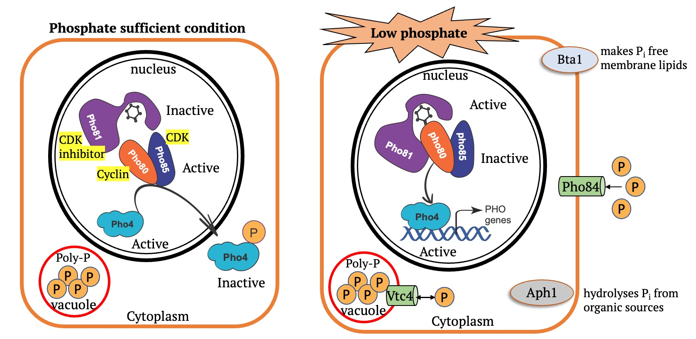
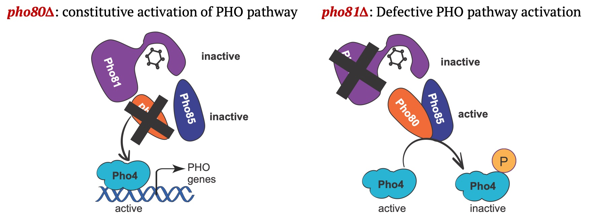
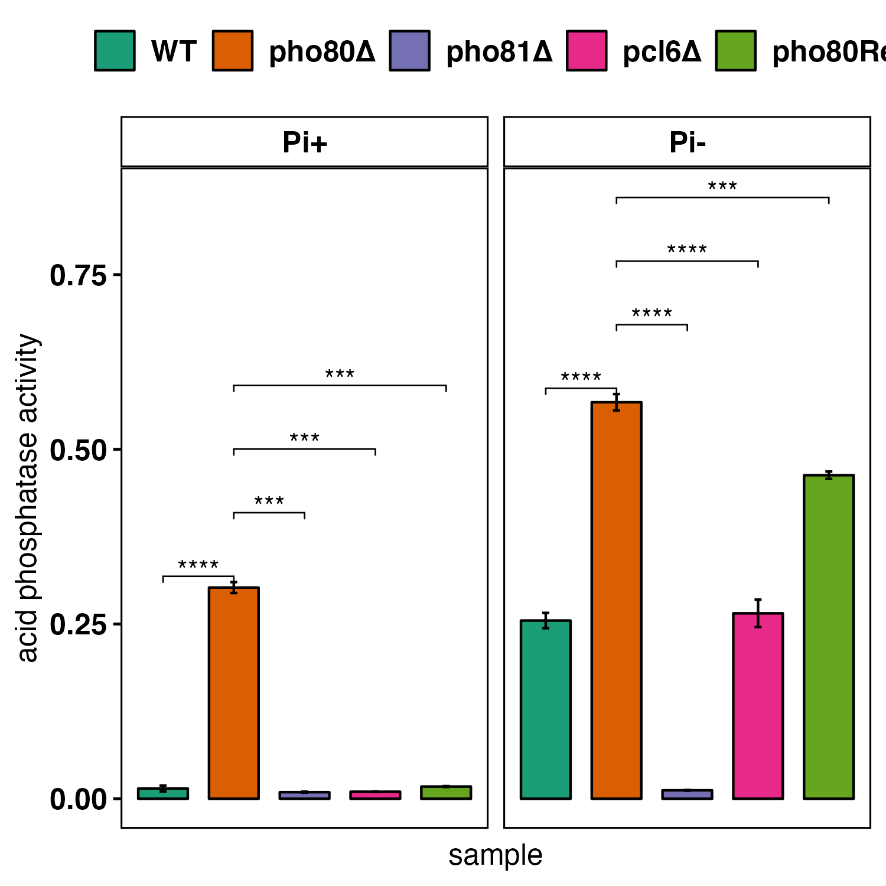
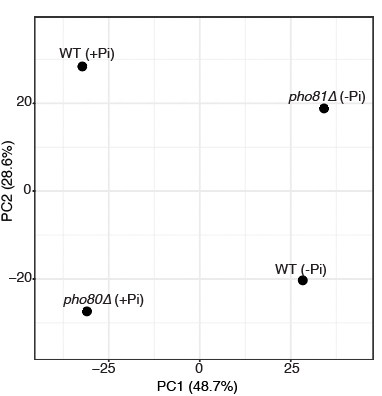

---
output:
  md_document:
    variant: markdown_github
html_preview: true
editor_options: 
  markdown: 
    wrap: 72
---

<!-- README.md is generated from README.Rmd. Please edit that file -->

```{r echo=FALSE}
knitr::opts_chunk$set(cache = TRUE)
```

# CnPho80Analysis

An R-package containing all the scripts and functions used to analyse
*C. neoformans* data to understand the effect of phosphate dysregulation
on cellular growth and infection. Results from this study are published
in paper entitled [***"Dysregulating PHO Signaling via the CDK Machinery
Differentially Impacts Energy Metabolism, Calcineurin Signaling, and
Virulence in Cryptococcus
neoformans"***](https://journals.asm.org/doi/10.1128/mbio.03551-22)

### Install this package

```         
if(require("devtools")){
        devtools::install_github("sethiyap/CnPho80Analysis")
} else{
        install.packages("devtools")
        devtools::install_github("sethiyap/CnPho80Analysis")
}
```

### Phosphate Acquisition pathway in *C. neoformans*



### Hypothesis: Dysregulation of CDK machinery has detrimental impact on phosphate homeostasis and attenuates virulence



### Constitutive activation of PHO pathway in pho80∆

#### acid phoshatase activity

```{r acid_phosphatase, echo=TRUE, eval=FALSE}

acid_data <- tibble::tribble(
                  ~sample,      ~`Pi+`,      ~`Pi-`,
                   "WT_1", 0.011204091, 0.258106747,
                   "WT_2", 0.019409866, 0.242821904,
                   "WT_3", 0.013333333, 0.264044944,
               "pho80∆_1", 0.295524146, 0.566013667,
               "pho80∆_2", 0.310817455, 0.556350938,
               "pho80∆_3", 0.300179319, 0.579698905,
               "pho81∆_1", 0.009410548, 0.011530945,
               "pho81∆_2", 0.010116929, 0.012233286,
               "pho81∆_3", 0.008729744, 0.012394366,
                "pcl6∆_1", 0.009906977, 0.243656137,
                "pcl6∆_2", 0.010315186,  0.27057683,
                "pcl6∆_3", 0.009953488, 0.281757106
               )

CnPho80Analysis::plot_pvalues(dat_tble = acid_data, display_pval = FALSE, control_group = "pho80∆", scales = NULL, y_label = "acid phosphatase activity")

```

```{r acid_plot, echo=FALSE, out.width="50%"}

```

### RNASeq data for WT and *pho80∆*

RNASeq data for WT and pho80∆ under phosphate limited conditions was
downloaded from SRA database:
[PRJDB3514](https://www.ncbi.nlm.nih.gov/bioproject/PRJDB3514/)

Raw reads were downloaded using SRA-toolkit and mapped to *C.
neoformans* H99 genome obtained from FungiDB (release 54) using STAR
aligner. **Feature count** function of
[Rsubread](https://academic.oup.com/nar/article/47/8/e47/5345150)
R-package was used to obtain mapped read counts for each gene.

#### STAR alignment

```         
qsub star_alignment_job_submission.sh
```

#### Rsubread to get count matrix

```{r rsubread, echo=TRUE, eval=FALSE}

gff_file <- "ref_genome/FungiDB-54_CneoformansH99.gff"
dir = list.files("Cn_phosphateAnalysis/BAM/")

bam_files <- tibble::as_tibble(dir)

count_tibble <- bam_files %>%
              dplyr::mutate(read_count = purrr::map(value, function(ii){
                cd <- Rsubread::featureCounts(files = ii, 
                                              annot.ext = gff_file,
                                              isGTFAnnotationFile = TRUE, 
                                              isPairedEnd = TRUE)
                cc <- cd$counts %>% as.data.frame()%>% 
                  tibble::rownames_to_column("gene_name")
              })) 

count_mat <- count_tibble %>% 
                dplyr::select(2) %>% 
                tidyr::unnest(cols = c(read_count)) %>% 
                tidyr::pivot_longer(cols = -c(gene_name)) %>% 
                tidyr::drop_na() %>%
                tidyr::pivot_wider(names_from = name,values_from = value)
```

For cna1∆ data, mapped read counts were downloaded from GEO
database:[GSE93005](https://www.ncbi.nlm.nih.gov/geo/query/acc.cgi?acc=GSE93005)

#### Computation of normalized read counts

Normalized read counts for each gene were determined by DESeq2 for all
the datasets. Genes with read count \<2 in all conditions were filtered.
For differential gene expression analysis, genes with Log2FC \>= 1 and
Log2FC \<= -1 were classified as up- and down-regulated genes,
respectively.

```{r normalized_reads, echo=TRUE, eval=FALSE}

library(magrittr)

dir="count_file"
pattern="_star_alignAligned.sortedByCoord.out.bam_count.txt"
metadata <- "inst/extdata/metadata.txt"
deg <- CnPho80Analysis::deseq_from_htseqcount(dir, pattern = pattern, metadata_file = "metadata.txt", header_count_file = TRUE, HTSeqOutput = FALSE, drop_genes = NULL, write_output = FALSE)

```

PCA plot highlights that transcriptiome of each sample is distinct from
each other (generated using
[FungiexpresZ](https://cparsania.shinyapps.io/FungiExpresZ/)).

```{r pca_plot, echo=FALSE, out.width="50%"}

```

### Genes affected by phosphate limitation and overload

```{r DEG_genes, echo=TRUE, eval=TRUE}

library(magrittr)
DEG <- tibble::tribble(
          ~Class, ~`LFC_WT(-Pi/+Pi)`, ~`LFC_pho80∆/WT(+Pi)`,
            "Up",               671L,                  532L,
          "Down",               650L,                  425L
          )
 
dg <- DEG %>% 
            tidyr::gather(condition, num_gene, -Class) %>%
            dplyr::mutate(condition=forcats::as_factor(condition), 
                          Class=forcats::as_factor(Class)) %>%
            ggplot2::ggplot(ggplot2::aes(Class, num_gene, fill=Class, label=num_gene))+
            ggplot2::geom_col()+
            ggplot2::facet_wrap(~condition)+
            ggplot2::geom_text(vjust=-0.5)+
            ggplot2::scale_fill_manual(values=c("#ED0000FF","#00468BFF"))+
            ggplot2::theme_bw()

dg
```

### Phosphate acquisition genes

Data validation by measuring the expression of phosphate acquisition
pathway genes.

```{r barplot_pho_genes, echo=TRUE}

PHO_genes <- tibble::tribble(
                 ~Gene, ~`LFC_WT(-Pi/+Pi)`, ~`LFC_pho80∆/WT(+Pi)`, ~`LFC_pho81∆/WT(-Pi)`,
                "AKP1",        4.765711394,           2.956528741,          -4.289050233,
                "APH1",        8.176126192,           6.896639271,          -8.387521025,
               "PHO80",        2.119554668,           -1.41425552,          -2.922529881,
               "PHO81",        1.976859058,            1.74039531,          -3.012824376,
               "PHO84",        7.346774993,           5.504759458,          -7.134745782,
               "PHO89",        4.608061737,           2.096706399,          -4.485037531,
                "VTC4",        3.157037614,           3.191765246,          -3.350748834,
                "BTA1",        6.099048089,           2.902203375,          -5.726045631
               )

pp <- PHO_genes %>% 
          tidyr::gather(condition, Log2FC, -Gene) %>%
          dplyr::mutate(condition=forcats::as_factor(condition)) %>%
          ggplot2::ggplot(ggplot2::aes(Gene, Log2FC, fill=condition))+
          ggplot2::geom_col(position = "dodge", color="black")+
          ggplot2::scale_fill_manual(values=c("#0072B2", "#D55E00", "#CC79A7"))+
          ggplot2::theme_bw()
  
pp

```

### Functional analysis by GO-term enrichment

Functions of the differential expressed genes (DEGs) was determined by
performing GO-term enrichment at FungiDb using *C.neoformans* H99 as
background strain.

```{r GO_plot, echo=TRUE, eval=TRUE, warning=FALSE, message=FALSE, tidy=TRUE}

dat_go <- readr::read_delim("inst/extdata/GO_enrichment.txt", delim="\t", col_names = TRUE)

go_gg <- dat_go %>% dplyr::mutate(Name=forcats::as_factor(Name),
                                  Class=factor(Class, levels=rev(unique(Class)))) %>%
          ggplot2::ggplot(ggplot2::aes(Class,Name))+
            ggplot2::geom_point(ggplot2::aes(size=Pct_of_bgd),color="black",shape=23, stroke=0.8)+
            ggplot2::geom_point(ggplot2::aes(size=Pct_of_bgd,alpha=-log10(Pvalue), fill=Class),shape=23)+
            ggplot2::facet_wrap(~Category, scales="free")+
            ggplot2::scale_fill_manual(values=c("#ED0000FF","#00468BFF"))+
            ggplot2::facet_wrap(~Category)+
            ggplot2::theme_bw()+
            ggplot2::scale_x_discrete(expand = c(0.8,0.8))

go_gg

```

### GO enrichment *pho80∆*, *pho81∆*

```{r GO_plot2, echo=TRUE, eval=TRUE, warning=FALSE, message=FALSE, tidy=TRUE}

go_dat <- readr::read_delim("inst/extdata/pho80_pho81_GO.txt", delim="\t", col_names = TRUE)

go_gg1 <- go_dat %>% 
                dplyr::mutate(name=forcats::as_factor(name))%>%
                ggplot2::ggplot(ggplot2::aes(class,name))+
                ggplot2::geom_point(ggplot2::aes(size=pct_of_bgd,color=type,shape=type), stroke=0.8)+
            ggplot2::scale_color_manual(values=c("#00468BFF","#ED0000FF"))+ ggplot2::theme_bw()+
  ggplot2::facet_wrap(~group, scales="free", strip.position="right", ncol=1)+
            ggplot2::scale_x_discrete(expand = c(0.5,0.5))+
  ggplot2::theme(axis.text = ggplot2::element_text(color="black", size = 12))

print(go_gg1)
```

### Comparison of *cna1∆* with *pho80∆*

```{r calcineurin_genes, echo=TRUE, eval=TRUE, warning=FALSE, message=FALSE, tidy=TRUE}

cna1_compare <- readr::read_delim("inst/extdata/calcineurin_compare.txt",show_col_types = FALSE)

# pho80∆
CnPho80Analysis::compare_two_rnaseq(rnaseq_dat = cna1_compare, data_1 = "cna1∆/WT(37C)", data_2 = "pho80∆/WT(+Pi)")

# pho81∆
CnPho80Analysis::compare_two_rnaseq(rnaseq_dat = cna1_compare, data_1 = "cna1∆/WT(37C)", data_2 = "pho81∆/WT(-Pi)")

```

### Comparison of *pho80∆* with rapamycin treated cells

```{r rapa_genes, echo=TRUE, eval=TRUE, warning=FALSE, message=FALSE, tidy=TRUE}

dat <- readr::read_delim(file = "inst/extdata/rapamycin_compare.txt", show_col_types = FALSE)

# pho80∆
CnPho80Analysis::compare_two_rnaseq(rnaseq_dat = dat, data_1 = "WT+Rapa/WT", data_2 = "pho80∆/WT(+Pi)")

# pho81∆
CnPho80Analysis::compare_two_rnaseq(rnaseq_dat = dat, data_1 = "WT+Rapa/WT", data_2 = "pho81∆/WT(-Pi)")

```

### qPCR on rapamycin treated cells

#### Experiment in brief: 

1.  Cells (WT and pho80Δ) were incubated O/N in YPD at 30C, 250rpm

2.  Cells were washed twice with water (4500rpm, 5min)

3.  OD600 was measured

4.   Cells were diluted as OD=1/ml in 10ml fresh YPD

5.  Cells were treated with 1μg/ml rapamycin and equal amount of DMSO as
    control

6.  Cells were incubated for 2hr at 37C, 250rpm.

7.   Cells were harvested and snap frozen in liquid Nitrogen followed by
    storage in -80C.

8.  RNA extraction (trizol method) and cDNA synthesis.

9.  qPCR of genes commonly induced or down-regulated in pho80Δ/WT and
    WT+rapa/WT RNASeq data

ΔΔCt and fold change calculation

-   Housekeeping gene: ACT1 (actin), Gene of Interest: ABC

-   ΔCt: Ct value ABC - Ct value ACT1

-   Avg ΔCt: Average of ΔCt control (WT) ΔΔCt: ΔCt - Avg ΔCt

-   Foldchange: 2\^-ΔΔCt

-   Pvalue was determined by t-test.

```{r rapa_qPCR, echo=TRUE, eval=TRUE, warning=FALSE, message=FALSE, tidy=TRUE}

rapa_qPCR <- readr::read_delim("inst/extdata/qPCR_rapa.txt", delim="\t", col_names = TRUE)

rapa_FC <- CnPho80Analysis::compute_qPCR_foldchange(dat_qPCR = rapa_qPCR, house_keeping = "ACT1", control = "WT",treatment = c("WT+Rapa"), return_pval = FALSE)

CnPho80Analysis::plot_qPCR_foldchange(fc_tibble = rapa_FC, display_pval = FALSE, control_group = "pho80",nrow = 1)

```

### Infection Assay

Intravenous infection model

```{r survival_assay_1, echo=TRUE, eval=TRUE, message=FALSE, warning=FALSE}

surv_dat <- readr::read_delim("inst/extdata/survival_data.txt") 

sc_intra <- surv_dat %>% 
            dplyr::filter(condition=="Intravenous") %>%
            dplyr::select(-c(condition))

CnPho80Analysis::plot_survival_curve(survival_data = sc_intra, palette = NULL, display_pval = TRUE)
        
```

Inhalation infection model

```{r survival_assay_2, echo=TRUE, eval=TRUE}

sc_inh <- surv_dat %>% 
            dplyr::filter(condition=="Inhalation") %>%
            dplyr::select(-c(condition))

CnPho80Analysis::plot_survival_curve(survival_data = sc_inh, palette = NULL, display_pval = TRUE)
```

PBMC

```{r PBMC_dat,echo=TRUE, eval=TRUE, message=FALSE, warning=FALSE }

PBMC_dat <- tibble::tribble(
                 ~sample, ~Media_control, ~`Media+PBMC`,
                  "WT_1",       2530000L,      2830000L,
                  "WT_2",       2350000L,      2600000L,
                  "WT_3",       2580000L,      3350000L,
              "pho80Δ_1",       2830000L,      1190000L,
              "pho80Δ_2",       2300000L,      1440000L,
              "pho80Δ_3",       1780000L,      1340000L,
              "pho81Δ_1",       2230000L,      1240000L,
              "pho81Δ_2",       1530000L,      1180000L,
              "pho81Δ_3",       1600000L,      1330000L
              )

CnPho80Analysis::plot_pvalues(dat_tble = PBMC_dat, display_pval = FALSE, control_group = "WT", scales = NULL, y_label = "CFU/ml")
```

### 
