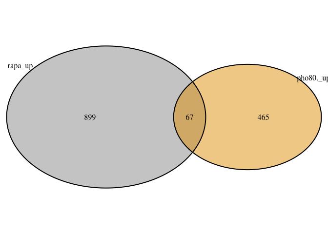

<!-- README.md is generated from README.Rmd. Please edit that file -->

# CnPho80Analysis

R-package containing all the scripts and functions used to analyse *C.
neoformans* RNASeq data to understand the effect of phosphate overload.

## RNASeq data for WT and pho80∆

RNASeq data for WT and pho80∆ under phosphate limited conditions was
downloaded from SRA database:
[PRJDB3514](https://www.ncbi.nlm.nih.gov/bioproject/PRJDB3514/)

Raw reads were downloaded using SRA-toolkit and mapped to *C.
neoformans* H99 genome obtained from FungiDB (release 54) using STAR
aligner. **Feature count** function of
[Rsubread](https://academic.oup.com/nar/article/47/8/e47/5345150)
R-package was used to obtain mapped read counts for each gene.

### STAR alignment

    qsub star_alignment_job_submission.sh

### Rsubread to get count matrix

``` r
gff_file <- "ref_genome/FungiDB-54_CneoformansH99.gff"
dir = list.files("Cn_phosphateAnalysis/BAM/")

bam_files <- tibble::as_tibble(dir)

count_tibble <- bam_files %>%
              dplyr::mutate(read_count = purrr::map(value, function(ii){
                cd <- Rsubread::featureCounts(files = ii, 
                                              annot.ext = gff_file,
                                              isGTFAnnotationFile = TRUE, 
                                              isPairedEnd = TRUE)
                cc <- cd$counts %>% as.data.frame()%>% 
                  tibble::rownames_to_column("gene_name")
              })) 

count_mat <- count_tibble %>% 
                dplyr::select(2) %>% 
                tidyr::unnest(cols = c(read_count)) %>% 
                tidyr::pivot_longer(cols = -c(gene_name)) %>% 
                tidyr::drop_na() %>%
                tidyr::pivot_wider(names_from = name,values_from = value)
```

For cna1∆ data, mapped read counts were downloaded from GEO
database:[GSE93005](https://www.ncbi.nlm.nih.gov/geo/query/acc.cgi?acc=GSE93005)

### Computation of normalized read counts

Normalized read counts for each gene were determined by DESeq2 for all
the datasets. Genes with read count \<2 in all conditions were filtered.
For differential gene expression analysis, genes with Log2FC \>= 1 and
Log2FC \<= -1 were classified as up- and down-regulated genes,
respectively.

``` r
library(magrittr)

dir="count_file"
pattern="_star_alignAligned.sortedByCoord.out.bam_count.txt"
metadata <- "data/metadata.txt"
deg <- CnPho80Analysis::deseq_from_htseqcount(dir, pattern = pattern, metadata_file = "metadata.txt", header_count_file = TRUE, HTSeqOutput = FALSE, drop_genes = NULL, write_output = FALSE)
```

PCA plot highlights that transcriptiome of each sample is distinct from
each other (generated using
[FungiexpresZ](https://cparsania.shinyapps.io/FungiExpresZ/)).
 ## Genes affected
by phosphate limitation and overload

``` r
library(magrittr)
DEG <- tibble::tribble(
          ~Class, ~`LFC_WT(-Pi/+Pi)`, ~`LFC_pho80∆/WT(+Pi)`,
            "Up",               671L,                  532L,
          "Down",               650L,                  425L
          )
 
dg <- DEG %>% 
            tidyr::gather(condition, num_gene, -Class) %>%
            dplyr::mutate(condition=forcats::as_factor(condition), 
                          Class=forcats::as_factor(Class)) %>%
            ggplot2::ggplot(ggplot2::aes(Class, num_gene, fill=Class, label=num_gene))+
            ggplot2::geom_col()+
            ggplot2::facet_wrap(~condition)+
            ggplot2::geom_text(vjust=-0.5)+
            ggplot2::scale_fill_manual(values=c("#ED0000FF","#00468BFF"))+
            ggplot2::theme_bw()

dg
```



## Phosphate acquisition genes

Data validation by measuring the expression of phosphate acquisition
pathway genes.

``` r
PHO_genes <- tibble::tribble(
               ~CNAG_name, ~`LFC_WT(-Pi/+Pi)`, ~`LFC_pho80∆/WT(+Pi)`,
                   "AKP1",        4.765711394,           2.956528741,
                   "APH1",        8.176126192,           6.896639271,
                  "PHO80",        2.119554668,           -1.41425552,
                  "PHO81",        1.976859058,            1.74039531,
                  "PHO84",        7.346774993,           5.504759458,
                  "PHO89",        4.608061737,           2.096706399,
                   "VTC4",        3.157037614,           3.191765246,
                   "BTA1",        6.099048089,           2.902203375
               )

pp <- PHO_genes %>% 
          tidyr::gather(condition, Log2FC, -CNAG_name) %>%
          dplyr::mutate(condition=forcats::as_factor(condition)) %>%
          ggplot2::ggplot(ggplot2::aes(CNAG_name, Log2FC, fill=condition))+
          ggplot2::geom_col(position = "dodge", color="black")+
          ggplot2::scale_fill_manual(values=c("#0099B4FF", "#925E9FFF"))+
          ggplot2::theme_bw()
  
pp
```


## Functional analysis by GO-term enrichment

Functions of the differential expressed genes (DEGs) was determined by
performing GO-term enrichment at FungiDb using *C.neoformans* H99 as
background strain.

``` r
dat_go <- readr::read_delim("data/GO_enrichment.txt", delim="\t", col_names = TRUE)
```

    ## Rows: 44 Columns: 6
    ## ── Column specification ────────────────────────────────────────────────────────
    ## Delimiter: "\t"
    ## chr (3): Name, Class, Category
    ## dbl (3): Result_count, Pct_of_bgd, Pvalue
    ## 
    ## ℹ Use `spec()` to retrieve the full column specification for this data.
    ## ℹ Specify the column types or set `show_col_types = FALSE` to quiet this message.

``` r
go_gg <- dat_go %>% dplyr::mutate(Name=forcats::as_factor(Name),
                                  Class=factor(Class, levels=rev(unique(Class)))) %>%
          ggplot2::ggplot(ggplot2::aes(Class,Name))+
            ggplot2::geom_point(ggplot2::aes(size=Pct_of_bgd),color="black",shape=23, stroke=0.8)+
            ggplot2::geom_point(ggplot2::aes(size=Pct_of_bgd,alpha=-log10(Pvalue), fill=Class),shape=23)+
            ggplot2::facet_wrap(~Category, scales="free")+
            ggplot2::scale_fill_manual(values=c("#ED0000FF","#00468BFF"))+
            ggplot2::facet_wrap(~Category)+
            ggplot2::theme_bw()+
            ggplot2::scale_x_discrete(expand = c(0.8,0.8))

go_gg
```

 ##
Comparison of cna1∆ with pho80∆

``` r
venn_dat2 <- read.table("data/Pho80_Cna1_DEGs.txt",sep="\t", header=TRUE)

gg_2 = as.list(venn_dat2)

v2 = lapply(gg_2,unique)

c2 = lapply(v2, function(x) x[!x %in% ""])
lengths(c2)
```

    ##   cna1_37C_Down     cna1_37C_Up Pho80_hiPi_Down   Pho80_hiPi_Up 
    ##             270             105             425             532

``` r
names(c2)=factor(names(c2))
upset_venn2 <- UpSetR::upset(UpSetR::fromList(c2), 
          nsets = ncol(venn_dat),
          order.by = c("degree"),
          keep.order=TRUE,sets=names(c2),
          sets.bar.color = c("#00468BFF","#ED0000FF", "#00468BFF", "#ED0000FF"),
          text.scale=2, sets.x.label = "No. of genes")

upset_venn2
```


## Comparison of pho80∆ with rapamycin treated cells
